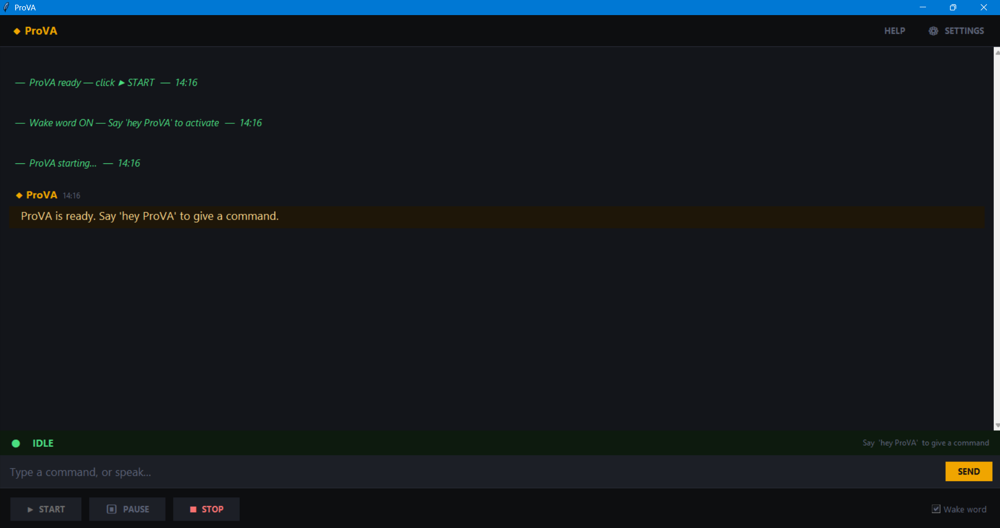
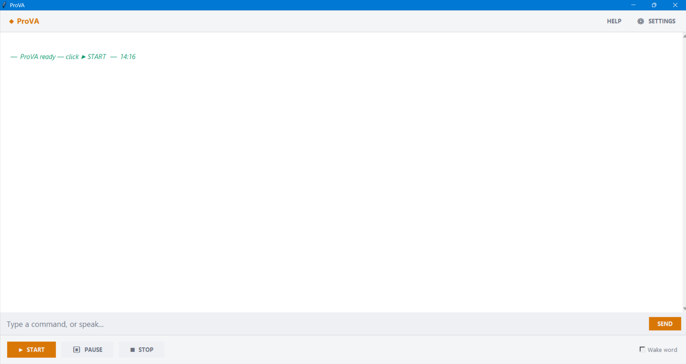

# ProVA — Productivity Voice Assistant

> A desktop-based voice assistant for Windows that lets you manage files, send emails, set reminders, launch apps, and generate Excel dashboards — all by speaking or typing.

Built as a BSc Data Science project by **AunRaza ImranRaza Shaikh**  
Shree L. R. Tiwari Degree College · University of Mumbai · 2025–26

---

## What ProVA Can Do

| Module | What you can say |
|---|---|
| **File Manager** | "Create a folder reports", "Delete folder old stuff", "Rename notes to final notes", "Copy report to desktop" |
| **Email** | "Send email to Nida", "Help me write an email to John about the meeting" |
| **Reminders** | "Remind me to call John at 5 pm", "Set alarm for 9:30 am", "Remind me in 10 minutes", "Set daily reminder for 8 am" |
| **App Control** | "Open Excel", "Open Chrome", "Open calculator", "Launch terminal" |
| **Web Search** | "Search Python tutorials", "Google machine learning basics" |
| **Excel Dashboard** | "Create dashboard from sales.xlsx" — auto-generates KPIs, charts, pivot tables |
| **Help** | "Help", "Help with email", "Help with reminders" |

Voice and typed input are fully interchangeable at every prompt — if ProVA asks you something, you can either speak or type your answer in the chat box.

---

## Screenshots

### Dark Mode UI



### Light Mode UI


---

## Installation

### Requirements
- Windows 10 or 11
- Python 3.10 or 3.11 ([download](https://www.python.org/downloads/))
- Microphone (built-in or external)
- Internet connection (for Google Speech Recognition)

### Step 1 — Download

```
Code → Download ZIP → Extract → place ProVA_final_v3 anywhere
```

Or clone:
```bash
git clone https://github.com/notaun/ProVA
```

### Step 2 — Install Python

Download Python 3.10 or 3.11 from [python.org](https://www.python.org/downloads/).

> ⚠️ During install, make sure **"Add Python to PATH"** is ticked.

### Step 3 — Run Setup

Double-click `setup.bat` inside the `ProVA_final_v3` folder.

It will automatically:
- Verify Python is installed and the version is supported
- Create a virtual environment (`.venv`)
- Install all dependencies from `requirements.txt`
- Run the pywin32 post-install step
- Create a **ProVA shortcut on your Desktop**

> Takes 2–5 minutes depending on internet speed.

### Step 4 — Configure Email *(optional)*

Open `.env` in Notepad and fill in your Gmail credentials:

```
PROVA_EMAIL=your@gmail.com
PROVA_APP_PASSWORD=xxxx xxxx xxxx xxxx
```

**How to get a Gmail App Password:**
1. Go to your Google Account → Security
2. Enable 2-Step Verification
3. Go to App Passwords → generate one for "Mail"
4. Paste the 16-character code into `.env`

Email will not work without this. Everything else will.

### Step 5 — Launch

Double-click **ProVA** on your Desktop, or run `ProVA.bat` directly.

---

## Usage

1. Click **▶ START** in the ProVA window
2. Say **"hey ProVA"** to wake it up
3. Give a command by voice — or just type it in the chat box

ProVA will speak its responses and show them in the chat log.

### Tips

- Voice and typing are interchangeable — if ProVA asks for a subject, email address, or confirmation, you can speak *or* type your answer
- If your mic energy is low, raise input volume in **Windows Settings → Sound → Input**
- Bluetooth headsets work but built-in mics give better STT accuracy

---

## Project Structure

```
ProVA_final_v3/
│
├── setup.bat               ← Run once to install
├── ProVA.bat               ← Run every time to launch
│
├── prova_ui.py             ← Desktop UI (Tkinter)
├── parser.py               ← Intent detection & slot filling
├── router.py               ← Command dispatcher
├── voice_module.py         ← STT, TTS, mic, wake word, gate logic
├── requirements.txt
├── .env                    ← Email credentials (not committed)
│
├── data/
│   ├── contacts.json       ← Saved email contacts
│   └── reminders.json      ← Persisted reminders
│
├── storage/                ← ProVA's file workspace
│
└── modules/
    ├── computer_control.py
    ├── email_module.py
    ├── file_manager.py
    ├── help_module.py
    ├── reminder_module.py
    └── excel_module/
        ├── handle.py
        ├── core.py
        ├── run_dashboard.py
        └── ...
```

---

## Tech Stack

| Layer | Technology |
|---|---|
| Language | Python 3.10+ |
| UI | Tkinter |
| Speech-to-Text | Google Web Speech API via `SpeechRecognition` |
| Text-to-Speech | `pyttsx3` (offline, Windows SAPI voices) |
| Intent Matching | Keyword patterns + `fuzzywuzzy` fuzzy fallback |
| Email | `smtplib` (Gmail SMTP) + `python-dotenv` |
| Reminders | `asyncio` + `threading` + `winsdk` toast notifications |
| Excel | `pandas` + `openpyxl` |
| Notifications | `winsdk` → PowerShell XML → `plyer` (3-layer fallback) |

---

## Troubleshooting

**PyAudio fails to install**
```bash
pip install pipwin
pipwin install pyaudio
```

**"No microphone found"**
- Windows Settings → Sound → Input → confirm your mic is listed
- Windows Settings → Privacy → Microphone → allow app access

**Mic energy too low / STT not picking up voice**
- Windows Settings → Sound → Input → raise Input Volume to 80–100%
- Switch to a wired or built-in mic if using Bluetooth

**Email not sending**
- Make sure `.env` has `PROVA_EMAIL` and `PROVA_APP_PASSWORD` filled in
- Use a Gmail App Password, not your regular Gmail password
- Confirm 2-Step Verification is enabled on your Google account

**pywin32 error on first run**
```bash
.venv\Scripts\python.exe -m pywin32_postinstall -install
```

---

## Limitations

- Windows 10/11 only (some features use Windows-specific APIs)
- English commands only
- Requires internet for speech recognition (Google STT)
- Email module supports Gmail only
- Commands need to be reasonably structured — limited free-form NLU

---

## Future Scope

- Offline speech recognition (Whisper / Vosk)
- Multi-language support
- Cross-platform (Linux / macOS)
- More email providers
- Custom user-defined voice commands
- LLM integration for conversational understanding
- Cloud sync for reminders and contacts

---

## Author

Aunraza Shaikh.  
Ty BSc Data Science.  
This project was submitted as an academic project to the University of Mumbai.
